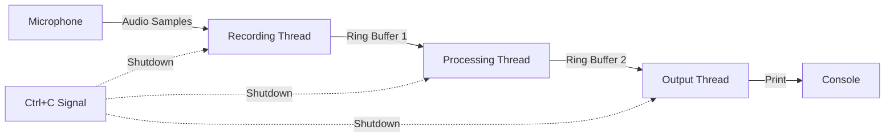

# Design Document

## Overview

This design document outlines the architecture for introducing a `FrameProcessor` trait to unify the streaming audio processing patterns used in both the Parakeet and VAD crates. The trait will provide a common interface for frame-by-frame audio processing with ring buffer-based producer-consumer patterns.

The refactoring will create a shared trait in a common location that both crates can use, while keeping the existing struct implementations largely intact. The trait will define the core processing lifecycle methods, and implementations will be provided directly in trait impl blocks for `StreamingParakeetTDT` and `StreamingVad`.

## Architecture

### Module Structure

```
crates/
├── frame-processor/              # New shared crate
│   ├── Cargo.toml
│   └── src/
│       └── lib.rs                # FrameProcessor trait definition
├── parakeet/
│   ├── Cargo.toml                # Add frame-processor dependency
│   └── src/
│       └── streaming.rs          # StreamingParakeetTDT + FrameProcessor impl
└── vad/
    ├── Cargo.toml                # Add frame-processor dependency
    └── src/
        └── streaming_vad.rs      # StreamingVad + FrameProcessor impl
```

The `FrameProcessor` trait will be defined in a new lightweight `frame-processor` crate. This approach:
- Keeps the trait independent from both implementations
- Allows using either `parakeet` or `vad` without pulling in the other
- Provides a clean separation of concerns
- Makes the trait reusable for future audio processing implementations

### Trait Design Philosophy

The trait follows these design principles:
1. **Simplicity**: Minimal required methods with sensible defaults
2. **Flexibility**: Associated types allow customization per implementation
3. **Lifecycle Management**: Clear start, process, and finish semantics
4. **Error Handling**: Consistent error propagation using `thiserror`
5. **Drop Safety**: Automatic finalization on drop

## Components and Interfaces

### FrameProcessor Trait

```rust
use async_trait::async_trait;
use thiserror::Error;

/// Error type for frame processing operations
#[derive(Error, Debug)]
pub enum FrameProcessorError {
    #[error("Processing error: {0}")]
    ProcessingError(String),

    #[error("Buffer error: {0}")]
    BufferError(String),

    #[error("Model error: {0}")]
    ModelError(#[from] Box<dyn std::error::Error + Send + Sync>),
}

/// Trait for frame-by-frame audio processing with streaming semantics
#[async_trait]
pub trait FrameProcessor {
    /// The error type returned by processing operations
    type Error: std::error::Error + Send + Sync + 'static;

    /// Check if another frame is available for processing
    ///
    /// Returns `true` if `process_frame` can be called to process the next frame.
    /// This should check the internal buffer state to determine availability.
    fn has_next_frame(&self) -> bool;

    /// Process the next available frame
    ///
    /// This method should:
    /// 1. Extract the next frame from the input buffer
    /// 2. Perform the necessary processing (VAD, transcription, etc.)
    /// 3. Emit results to the output buffer
    /// 4. Update internal state
    ///
    /// # Errors
    ///
    /// Returns an error if frame processing fails for any reason.
    async fn process_frame(&mut self) -> Result<(), Self::Error>;

    /// Check if the stream has been marked as finished
    ///
    /// Returns `true` if no more input will be provided and all frames
    /// have been processed.
    fn is_finished(&self) -> bool;

    /// Mark the stream as finished
    ///
    /// This signals that no more input will be provided. The processor
    /// should prepare to process any remaining buffered frames.
    fn mark_finished(&mut self);

    /// Finalize processing after the stream is finished
    ///
    /// This method is called after all frames have been processed to perform
    /// any cleanup or final operations. Implementations can override this
    /// to add custom finalization logic.
    ///
    /// # Errors
    ///
    /// Returns an error if finalization fails.
    async fn finalize(&mut self) -> Result<(), Self::Error> {
        Ok(())
    }

    /// Process all available frames in a loop
    ///
    /// This default implementation continues processing while the stream
    /// is not finished, checking for available frames before each call
    /// to `process_frame`. Once the stream is marked as finished and all
    /// frames are processed, it calls `finalize()` and returns.
    ///
    /// # Errors
    ///
    /// Returns the first error encountered during frame processing or finalization.
    async fn process_loop(&mut self) -> Result<(), Self::Error> {
        while !self.is_finished() {
            if self.has_next_frame() {
                self.process_frame().await?;
            } else {
                // No frames available yet, yield to allow other tasks to run
                tokio::task::yield_now().await;
            }
        }

        // Process any remaining frames after stream is finished
        while self.has_next_frame() {
            self.process_frame().await?;
        }

        // Finalize processing
        self.finalize().await?;

        Ok(())
    }
}
```

### StreamingParakeetTDT Implementation

The `StreamingParakeetTDT` struct will implement `FrameProcessor` by adapting its existing methods:

```rust
#[async_trait]
impl FrameProcessor for StreamingParakeetTDT {
    type Error = crate::error::Error;

    fn has_next_frame(&self) -> bool {
        self.buffer.has_next_chunk()
    }

    async fn process_frame(&mut self) -> Result<(), Self::Error> {
        // Delegate to existing process_next_chunk method
        self.process_next_chunk().await?;
        Ok(())
    }

    fn is_finished(&self) -> bool {
        self.buffer.is_finished && !self.has_next_frame()
    }

    fn mark_finished(&mut self) {
        self.buffer.finish();
    }

    async fn finalize(&mut self) -> Result<(), Self::Error> {
        // Any cleanup needed after all frames are processed
        // Currently no additional finalization needed for Parakeet
        Ok(())
    }
}
```

### StreamingVad Implementation

The `StreamingVad` struct will implement `FrameProcessor` similarly:

```rust
#[async_trait]
impl FrameProcessor for StreamingVad {
    type Error = ort::Error;

    fn has_next_frame(&self) -> bool {
        self.audio_consumer.slots() >= self.params.frame_size_samples
    }

    async fn process_frame(&mut self) -> Result<(), Self::Error> {
        // Read one frame from the ring buffer
        if let Ok(frame) = self.audio_consumer.read_chunk(self.params.frame_size_samples) {
            let (first, second) = frame.as_slices();
            let frame_data = [first, second].concat();
            frame.commit_all();

            // Process through Silero VAD
            let speech_prob = self.silero.calc_level(&frame_data)?;

            // Update state
            self.state.update(&self.params, speech_prob);

            // Emit speech samples if triggered
            if self.state.triggered {
                for &sample in &frame_data {
                    let _ = self.speech_producer.push(sample);
                }
            }
        }

        Ok(())
    }

    fn is_finished(&self) -> bool {
        self.is_finished_flag && !self.has_next_frame()
    }

    fn mark_finished(&mut self) {
        self.is_finished_flag = true;
    }

    async fn finalize(&mut self) -> Result<(), Self::Error> {
        // Process final speech segment
        let total_samples = self.state.current_sample;
        self.state.check_for_last_speech(total_samples, &self.params);
        Ok(())
    }
}
```

### Drop Implementation

Both structs should implement `Drop` to ensure proper finalization. Since `process_loop` is async, we need to handle this carefully:

```rust
impl Drop for StreamingParakeetTDT {
    fn drop(&mut self) {
        if !self.is_finished() {
            self.mark_finished();
            // Note: Cannot call async process_loop in Drop
            // Users should explicitly call finalize or use process_loop before dropping
        }
    }
}

impl Drop for StreamingVad {
    fn drop(&mut self) {
        if !self.is_finished() {
            self.mark_finished();
            // Note: Cannot call async process_loop in Drop
            // Users should explicitly call finalize or use process_loop before dropping
        }
    }
}
```

**Note**: Since `Drop` is synchronous and `process_loop` is async, we cannot automatically process remaining frames in `Drop`. Users should explicitly call `mark_finished()` and `process_loop().await` before dropping, or we can provide a synchronous `finalize()` method that blocks on the async operations.

## Data Models

### State Management

Both implementations maintain internal state:

**StreamingParakeetTDT State:**
- `buffer: StreamingAudioBuffer` - Manages audio context and chunking
- `state: Option<State>` - LSTM decoder state
- `previous_token: i32` - Last emitted token for continuity

**StreamingVad State:**
- `state: State` - VAD state machine (triggered, timestamps, etc.)
- `silero: Silero` - The VAD model with internal state

The trait does not expose these internal states, keeping them as implementation details.

### Ring Buffer Flow


## Error Handling

### Error Type Hierarchy

```rust
// In parakeet crate
#[derive(Error, Debug)]
pub enum Error {
    #[error("ONNX Runtime error: {0}")]
    OrtError(#[from] ort::Error),

    #[error("Frame processing error: {0}")]
    FrameProcessingError(String),

    #[error("Buffer error: {0}")]
    BufferError(String),

    #[error("Invalid state: {0}")]
    InvalidState(String),
}

// In vad crate - already uses ort::Error directly
// No changes needed
```

### Error Propagation

Errors flow from the model layer up through the trait implementation:

1. Model inference error (ort::Error)
2. Frame processing error (trait method)
3. Process loop error (caller)

The `process_loop` default implementation propagates the first error encountered and stops processing.

## Testing Strategy

### Unit Tests

1. **Trait Method Tests**: Test each trait method in isolation
   - `has_next_frame` with various buffer states
   - `process_frame` with valid and invalid frames
   - `is_finished` state transitions
   - `mark_finished` behavior

2. **Implementation Tests**: Test trait implementations
   - StreamingParakeetTDT trait impl
   - StreamingVad trait impl

3. **Drop Tests**: Verify automatic finalization
   - Drop with unprocessed frames
   - Drop after explicit finalization

### Integration Tests

1. **End-to-End Processing**: Test complete processing pipelines
   - Feed audio → process → collect results
   - Verify output correctness

2. **Ring Buffer Integration**: Test producer-consumer patterns
   - Concurrent audio feeding and processing
   - Buffer overflow/underflow handling

3. **State Continuity**: Verify state is maintained across frames
   - LSTM state in Parakeet
   - VAD state machine transitions

### Example-Based Tests

Update existing examples to use the new trait:

```rust
// In examples
async fn process_with_trait<P: FrameProcessor>(mut processor: P) -> Result<(), P::Error> {
    processor.process_loop().await
}

// Usage
let (mut engine, audio_producer, token_consumer) =
    StreamingParakeetTDT::new(model, context, sample_rate);

// Feed audio in background thread
// ...

// Process using trait
process_with_trait(engine).await?;
```

## Async Design

### Rationale

The trait is designed as an async trait using the `async-trait` crate. This decision is based on:

1. **Parakeet Requirements**: The `StreamingParakeetTDT::process_next_chunk` method is async due to ONNX Runtime operations
2. **Flexibility**: Async methods can be called from both async and sync contexts (using block_on if needed)
3. **Future-Proofing**: Async is the direction Rust is moving for I/O-bound operations
4. **Consistency**: Both implementations use the same async interface

### Implementation Details

All trait methods that perform I/O or model inference are marked as `async`:

```rust
#[async_trait]
pub trait FrameProcessor {
    async fn process_frame(&mut self) -> Result<(), Self::Error>;
    async fn process_loop(&mut self) -> Result<(), Self::Error>;
}
```

### Drop Limitation

Since `Drop::drop` is synchronous, we cannot call async methods in the destructor. The `Drop` implementation will only mark the stream as finished:

```rust
impl Drop for StreamingParakeetTDT {
    fn drop(&mut self) {
        if !self.is_finished() {
            self.mark_finished();
            // Note: Cannot call async process_loop in Drop
            // Users should explicitly finalize before dropping
        }
    }
}
```

Users should explicitly finalize processing before dropping:

```rust
// Correct usage
processor.mark_finished();
processor.process_loop().await?;
drop(processor);

// Or use a scoped pattern
{
    let mut processor = create_processor();
    // ... use processor ...
    processor.mark_finished();
    processor.process_loop().await?;
} // processor dropped here
```

## Parakeet-Mic Multi-Threaded Architecture

### Overview

The parakeet-mic application will be refactored to use a multi-threaded architecture that leverages the FrameProcessor trait. This design separates concerns into three dedicated threads:

1. **Recording Thread**: Captures audio from the microphone
2. **Processing Thread**: Runs the FrameProcessor to transcribe audio
3. **Output Thread**: Prints transcription results to the console

### Thread Architecture



### Component Design

#### Recording Thread

```rust
fn recording_thread(
    audio_producer: rtrb::Producer<f32>,
    shutdown: Arc<AtomicBool>,
) -> Result<()> {
    // Initialize CPAL audio input stream
    let host = cpal::default_host();
    let device = host.default_input_device()?;
    let config = device.default_input_config()?;

    // Create audio stream that pushes samples to ring buffer
    let stream = device.build_input_stream(
        &config.into(),
        move |data: &[f32], _: &_| {
            for &sample in data {
                let _ = audio_producer.push(sample);
            }
        },
        |err| eprintln!("Audio error: {}", err),
        None,
    )?;

    stream.play()?;

    // Keep recording until shutdown signal
    while !shutdown.load(Ordering::Relaxed) {
        std::thread::sleep(Duration::from_millis(100));
    }

    Ok(())
}
```

#### Processing Thread

```rust
async fn processing_thread<P: FrameProcessor>(
    mut processor: P,
    shutdown: Arc<AtomicBool>,
) -> Result<(), P::Error> {
    // Process frames until shutdown signal
    while !shutdown.load(Ordering::Relaxed) {
        if processor.has_next_frame() {
            processor.process_frame().await?;
        } else {
            tokio::time::sleep(Duration::from_millis(10)).await;
        }
    }

    // Finalize processing
    processor.mark_finished();
    processor.process_loop().await?;

    Ok(())
}
```

#### Output Thread

```rust
fn output_thread(
    token_consumer: rtrb::Consumer<Token>,
    vocab: Arc<Vocab>,
    shutdown: Arc<AtomicBool>,
) -> Result<()> {
    let mut current_text = String::new();

    while !shutdown.load(Ordering::Relaxed) || !token_consumer.is_empty() {
        if let Ok(token) = token_consumer.pop() {
            let text = vocab.decode(&[token.id]);
            current_text.push_str(&text);

            // Print on word boundaries or punctuation
            if text.ends_with(' ') || text.ends_with('\n') {
                print!("{}", current_text);
                std::io::stdout().flush()?;
                current_text.clear();
            }
        } else {
            std::thread::sleep(Duration::from_millis(50));
        }
    }

    // Print any remaining text
    if !current_text.is_empty() {
        println!("{}", current_text);
    }

    Ok(())
}
```

### Main Application Flow

```rust
#[tokio::main]
async fn main() -> Result<()> {
    // Load model and create processor
    let model = ParakeetTDTModel::load("models/")?;
    let vocab = Arc::new(Vocab::load("models/vocab.txt")?);

    // Create ring buffers
    let (audio_producer, audio_consumer) = rtrb::RingBuffer::new(AUDIO_BUFFER_SIZE);
    let (token_producer, token_consumer) = rtrb::RingBuffer::new(TOKEN_BUFFER_SIZE);

    // Create processor
    let processor = StreamingParakeetTDT::new(
        model,
        audio_consumer,
        token_producer,
        SAMPLE_RATE,
    );

    // Setup shutdown signal
    let shutdown = Arc::new(AtomicBool::new(false));
    let shutdown_clone = shutdown.clone();

    ctrlc::set_handler(move || {
        shutdown_clone.store(true, Ordering::Relaxed);
    })?;

    // Spawn threads
    let recording_handle = std::thread::spawn({
        let shutdown = shutdown.clone();
        move || recording_thread(audio_producer, shutdown)
    });

    let processing_handle = tokio::spawn({
        let shutdown = shutdown.clone();
        async move { processing_thread(processor, shutdown).await }
    });

    let output_handle = std::thread::spawn({
        let shutdown = shutdown.clone();
        let vocab = vocab.clone();
        move || output_thread(token_consumer, vocab, shutdown)
    });

    // Wait for all threads to complete
    recording_handle.join().unwrap()?;
    processing_handle.await??;
    output_handle.join().unwrap()?;

    Ok(())
}
```

### Thread Synchronization

**Shutdown Coordination:**
- Use `Arc<AtomicBool>` for shutdown signaling
- Ctrl+C handler sets the flag
- All threads check the flag periodically
- Processing thread finalizes before exiting
- Output thread drains remaining tokens

**Ring Buffer Sizing:**
- Audio buffer: 1-2 seconds of audio (e.g., 48000 samples for 1s at 48kHz)
- Token buffer: 1000-2000 tokens (sufficient for several seconds of speech)

**Error Handling:**
- Each thread returns a Result
- Main thread collects and reports errors from all threads
- Shutdown signal triggers graceful cleanup even on errors

### Benefits of Multi-Threaded Design

1. **Concurrency**: Audio recording, processing, and output happen simultaneously
2. **Responsiveness**: No blocking between stages
3. **Separation of Concerns**: Each thread has a single responsibility
4. **Testability**: Each component can be tested independently
5. **Performance**: Utilizes multiple CPU cores effectively

## Migration Path

### Phase 1: Create frame-processor Crate
1. Create new `crates/frame-processor` directory
2. Add `Cargo.toml` with `async-trait` and `thiserror` dependencies
3. Create `src/lib.rs` with trait definition
4. Add comprehensive documentation

### Phase 2: Implement for Parakeet
1. Implement `FrameProcessor` for `StreamingParakeetTDT`
2. Add `Drop` implementation
3. Update tests to verify trait behavior

### Phase 3: Implement for VAD
1. Implement `FrameProcessor` for `StreamingVad`
2. Add `Drop` implementation
3. Update tests to verify trait behavior

### Phase 4: Refactor parakeet-mic
1. Implement multi-threaded architecture
2. Create recording, processing, and output threads
3. Add shutdown coordination with Ctrl+C handling
4. Update main.rs to orchestrate all threads

### Phase 5: Update Examples
1. Demonstrate trait usage in examples
2. Show generic processing functions
3. Document the new pattern

## Design Decisions and Rationales

### Decision 1: Trait Location
**Decision**: Define trait in a separate `frame-processor` crate
**Rationale**: Keeps the trait independent from both implementations, allowing users to depend on only the crates they need without pulling in unnecessary dependencies. This also makes the trait reusable for future audio processing implementations.

### Decision 2: Async Support
**Decision**: Use `async-trait` for async methods
**Rationale**: Maintains the async nature of Parakeet processing while providing a clean trait interface

### Decision 3: Drop-based Finalization
**Decision**: Implement `Drop` to auto-finalize
**Rationale**: Ensures resources are cleaned up and remaining frames are processed even if user forgets to call finalize

### Decision 4: Associated Error Type
**Decision**: Use associated type for errors
**Rationale**: Allows each implementation to use its natural error type (ort::Error for VAD, custom Error for Parakeet)

### Decision 5: Default process_loop
**Decision**: Provide default implementation of process_loop
**Rationale**: Reduces boilerplate and ensures consistent processing logic across implementations

## Performance Considerations

### Zero-Cost Abstraction
The trait should compile to the same machine code as the current direct method calls due to monomorphization.

### Async Overhead
Using `async-trait` adds a small heap allocation for the returned Future, but this is negligible compared to model inference time.

### Ring Buffer Efficiency
No changes to the underlying ring buffer implementation, so performance characteristics remain the same.

## Ring Buffer Abandonment Detection

### Overview

The rtrb ring buffer library provides `is_abandoned()` methods on both producers and consumers that return `true` when the corresponding endpoint has been dropped. This feature enables automatic detection of disconnections without requiring explicit signaling.

### Design

#### Input Stream Abandonment

When the audio producer is dropped (e.g., recording thread exits), the consumer can detect this:

```rust
// In has_next_frame implementation
fn has_next_frame(&self) -> bool {
    // Check if producer was abandoned
    if self.audio_consumer.is_abandoned() {
        // No more data will arrive, mark as finished
        return self.audio_consumer.slots() > 0;
    }

    // Normal operation: check for sufficient samples
    self.audio_consumer.slots() >= self.params.frame_size_samples
}
```

#### Output Stream Abandonment

When the output consumer is dropped (e.g., output thread exits), the producer can detect this:

```rust
// In process_frame implementation
async fn process_frame(&mut self) -> Result<(), Self::Error> {
    // Check if consumer was abandoned before processing
    if self.token_producer.is_abandoned() {
        // No point processing if nobody is listening
        self.mark_finished();
        return Ok(());
    }

    // Normal processing...
    self.process_next_chunk().await?;
    Ok(())
}
```

### Optional Output Producers for Bidirectional Shutdown

Output producers should be stored as `Option<T>` to enable bidirectional shutdown signaling. The processor drops its output producer in two scenarios:

1. **Downstream abandonment**: When the output consumer is abandoned (output thread exits)
2. **Upstream abandonment**: When the input producer is abandoned (input thread exits) and processing completes

```
Recording Thread → [audio_producer] → Processor → [token_producer: Option] → Output Thread
                                          ↓
                    Scenario 1: Output consumer abandoned → drop token_producer
                    Scenario 2: Audio producer abandoned → process remaining → drop token_producer
```

### Implementation Strategy

#### StreamingParakeetTDT Changes

The struct stores the token producer as `Option<Producer<TokenResult>>`:

```rust
pub struct StreamingParakeetTDT {
    // ... existing fields ...

    // Optional token producer for bidirectional shutdown signaling
    token_producer: Option<Producer<TokenResult>>,
}

impl StreamingParakeetTDT {
    /// Drop the token producer to signal end of output to downstream
    pub fn close_output(&mut self) {
        self.token_producer = None;
    }
}

#[async_trait]
impl FrameProcessor for StreamingParakeetTDT {
    fn has_next_frame(&self) -> bool {
        // Check for abandonment first
        if self.buffer.audio_consumer.is_abandoned() {
            // Process remaining buffered data
            return self.buffer.audio_consumer.slots() > 0;
        }

        self.buffer.has_next_chunk()
    }

    async fn process_frame(&mut self) -> Result<(), Self::Error> {
        // Scenario 1: Check if output consumer is abandoned
        if let Some(producer) = &self.token_producer {
            if producer.is_abandoned() {
                // Drop our token producer to signal downstream
                self.token_producer = None;
                self.mark_finished();
                return Ok(());
            }
        }

        self.process_next_chunk().await?;

        // Scenario 2: After processing, check if input is abandoned and no more frames
        if self.buffer.audio_consumer.is_abandoned() && !self.has_next_frame() {
            // All input processed, drop output producer
            self.token_producer = None;
        }

        Ok(())
    }
}
```

**Key behaviors**:
1. **Downstream shutdown**: When output thread exits → `token_producer.is_abandoned()` → drop `token_producer`
2. **Upstream shutdown**: When recording thread exits → `audio_consumer.is_abandoned()` → process remaining data → drop `token_producer` → output thread detects and exits

#### StreamingVad Changes

Similarly for StreamingVad:

```rust
pub struct StreamingVad {
    // ... existing fields ...

    // Optional speech producer for bidirectional shutdown signaling
    speech_producer: Option<Producer<f32>>,
}

impl StreamingVad {
    /// Drop the speech producer to signal end of output to downstream
    pub fn close_output(&mut self) {
        self.speech_producer = None;
    }
}

#[async_trait]
impl FrameProcessor for StreamingVad {
    fn has_next_frame(&self) -> bool {
        // Check for abandonment first
        if self.audio_consumer.is_abandoned() {
            // Process remaining buffered data
            return self.audio_consumer.slots() >= self.params.frame_size_samples;
        }

        self.audio_consumer.slots() >= self.params.frame_size_samples
    }

    async fn process_frame(&mut self) -> Result<(), Self::Error> {
        // Scenario 1: Check if output consumer is abandoned
        if let Some(producer) = &self.speech_producer {
            if producer.is_abandoned() {
                // Drop our speech producer to signal downstream
                self.speech_producer = None;
                self.mark_finished();
                return Ok(());
            }
        }

        self.process_frame_sync()?;

        // Scenario 2: After processing, check if input is abandoned and no more frames
        if self.audio_consumer.is_abandoned() && !self.has_next_frame() {
            // All input processed, drop output producer
            self.speech_producer = None;
        }

        Ok(())
    }
}

#[async_trait]
impl FrameProcessor for StreamingVad {
    fn has_next_frame(&self) -> bool {
        // Check for abandonment first
        if self.audio_consumer.is_abandoned() {
            // Process remaining buffered data
            return self.audio_consumer.slots() >= self.params.frame_size_samples;
        }

        self.audio_consumer.slots() >= self.params.frame_size_samples
    }

    async fn process_frame(&mut self) -> Result<(), Self::Error> {
        // Early exit if output is abandoned
        if self.speech_producer.is_abandoned() {
            self.mark_finished();
            return Ok(());
        }

        self.process_frame_sync()
    }
}
```

### Benefits

1. **Automatic Cleanup**: No need for explicit `mark_finished()` calls when threads exit normally
2. **Graceful Degradation**: System handles unexpected disconnections gracefully
3. **Simplified Code**: Reduces boilerplate in thread coordination
4. **Robust Shutdown**: Works even if shutdown signals are missed

### Usage Example

```rust
// Before: Manual coordination required
let shutdown = Arc::new(AtomicBool::new(false));
ctrlc::set_handler(move || {
    shutdown.store(true, Ordering::Relaxed);
})?;

// Recording thread checks shutdown flag
while !shutdown.load(Ordering::Relaxed) {
    // record audio...
}
processor.mark_finished(); // Explicit call needed

// After: Automatic detection
ctrlc::set_handler(move || {
    std::process::exit(0); // Just exit
})?;

// Recording thread exits on Ctrl+C
// Producer is dropped automatically
// Processor detects abandonment via is_abandoned()
// No explicit mark_finished() needed!
```

### Edge Cases

1. **Partial Data**: When producer is abandoned mid-stream, process all remaining buffered data before finishing
2. **Both Ends Abandoned**: If both producer and consumer are abandoned, exit immediately
3. **Race Conditions**: Check abandonment at the start of each processing iteration to catch drops quickly

## Future Enhancements

1. **Generic Frame Types**: Support different frame representations (f32, i16, etc.)

2. **Batch Processing**: Extend trait to support batch frame processing

3. **Metrics**: Add trait methods for performance monitoring

4. **Cancellation**: Support for graceful cancellation of processing loops

5. **Backpressure**: Better handling of slow consumers
